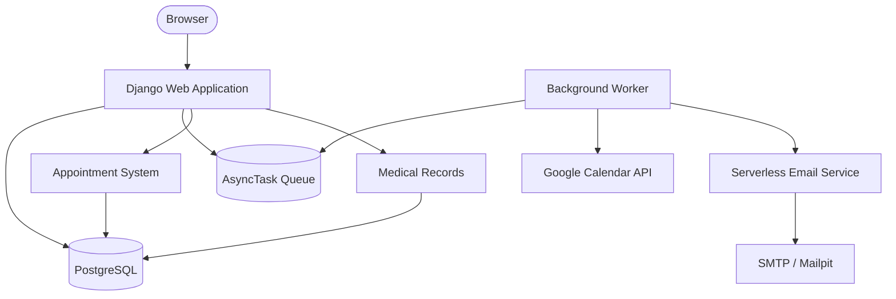

# MediBridge

[](https://www.djangoproject.com/)
[](https://www.postgresql.org/)
[](https://docs.docker.com/compose/)
[](LICENSE)

A Django-based hospital management system covering appointment scheduling, electronic medical records, doctor management, Google Calendar synchronization, and background email notifications.

---

## Why

Healthcare scheduling involves more than persisting a row in a database. A working system has to manage doctor availability, prevent double-bookings under concurrent requests, maintain patient records, send notifications, and synchronize with external calendars — all while keeping the booking transaction itself fast and reliable.

MediBridge was built to bring these workflows into a single Django application and work through the backend engineering concerns they create: how to protect a booking slot against race conditions, how to keep slow external API calls out of the request cycle, and how to wire together multiple services in a local development environment that actually mirrors the production dependencies.

---

## The Problem

A patient booking an appointment expects a straightforward flow:

1. Find an approved doctor.
2. View available slots generated from the doctor's working hours and leave schedule.
3. Select a slot and confirm the booking.
4. Receive a confirmation email.
5. See the appointment appear in Google Calendar.
6. Access the resulting medical record after the consultation.

The backend challenge is that step 3 must be safe under concurrency. Two patients can observe the same available slot and submit booking requests within milliseconds of each other. Without explicit protection, both requests can read the slot as available, both proceed, and the same slot is double-booked.

The system also cannot call the Google Calendar API or email service synchronously inside the booking request — network latency and third-party failures would directly degrade booking response time.

---

## How It Works

```
Patient / Doctor / Admin
         │
         ▼
   Django Web Application
         │
    ┌────┴────────────────────┐
    │                         │
    ▼                         ▼
PostgreSQL              AsyncTask Queue
(booking transaction)   (database-backed)
    │                         │
    ▼                    Background Worker
Appointment / EMR             │
                    ┌─────────┴──────────┐
                    ▼                    ▼
            Google Calendar API    Email Service
                                  (Serverless Offline)
                                         │
                                       SMTP
                                      (Mailpit)
```

The booking transaction uses `select_for_update()` inside `transaction.atomic()` to prevent concurrent double-bookings. External integrations — Google Calendar and email — are written to the `AsyncTask` queue and executed by a separate background worker, keeping the booking response time independent of third-party API latency.

---

## Concurrency Protection

This is the most important backend engineering decision in the project.

When a patient submits a booking request, the slot record is locked at the database row level before its status is checked:

```python
with transaction.atomic():
    slot = AvailabilitySlot.objects.select_for_update().get(pk=slot_id)

    if slot.status != 'AVAILABLE':
        raise ValidationError("This slot is no longer available.")

    slot.status = 'BOOKED'
    slot.save()
```

The sequence under concurrent requests:

1. Request A acquires the row lock.
2. Request A confirms the slot is `AVAILABLE` and sets it to `BOOKED`.
3. The transaction commits and the lock is released.
4. Request B acquires the lock, reads `BOOKED`, and raises a validation error.

This protects the appointment-slot state specifically. It does not imply broader system-wide consistency guarantees.

---

## Appointment Scheduling

Doctors configure their availability through:

- **Working hours**: days of the week and start/end times per day
- **Slot duration**: how long each appointment window runs
- **Buffer time**: gap between consecutive appointments
- **Leave periods**: date ranges during which no slots are generated

The system generates `AvailabilitySlot` records from these rules, skipping any slots that fall within active leave periods.

### Slot state machine

```
AVAILABLE
    │
    ▼
BOOKED ─────────────────► CANCELLED
    │                      NO_SHOW
    ▼
IN_CONSULTATION ─────────► CANCELLED
    │
    ▼
COMPLETED
```

State transitions are validated before execution, and only the appropriate role (patient, doctor, or admin) can trigger each transition.

---

## Electronic Medical Records

After a consultation is marked complete, the doctor creates a medical record associated with the booking. Records store:

- Diagnosis
- Symptoms
- Consultation notes
- Prescriptions (structured as JSON — medication, dosage, frequency, duration)
- Follow-up date

Patients can also upload medical reports independently — blood tests, MRI, CT scans, X-rays, prescriptions, and other document types — which are stored and viewable from the patient dashboard.

---

## User Roles

### Patient

- Browse approved doctors with filters (specialization, rating, availability)
- Book appointments through a three-step wizard
- Cancel bookings
- Access medical records and uploaded reports
- Submit ratings and reviews after completed consultations
- Connect Google Calendar for appointment synchronization

### Doctor

- Manage profile and specialization
- Configure working hours, slot duration, and buffer time
- Request leave periods (automatically cancels conflicting bookings)
- View daily appointment queue
- Record consultation details and prescriptions
- Connect Google Calendar

### Administrator

- Review and approve/reject doctor registration requests
- Suspend or soft-delete doctor accounts
- Manage hospital configuration (name, contact, branding)
- Monitor system health: database, SMTP, Google API credentials, task queue backlog

Doctor accounts follow a status lifecycle: `PENDING → APPROVED → SUSPENDED → REMOVED`. Soft-deletion preserves historical bookings and medical records rather than hard-deleting associated data.

---

## Background Task System

MediBridge uses a database-backed `AsyncTask` queue rather than Celery, Redis, or RabbitMQ. This keeps the infrastructure footprint light — the task queue is just a database table, and the worker is a Django management command.

Supported task types:

| Task Type | Action |
|---|---|
| `SEND_EMAIL` | Dispatch an email via the Serverless email service |
| `CREATE_CALENDAR` | Create a Google Calendar event |
| `UPDATE_CALENDAR` | Update an existing Google Calendar event |
| `DELETE_CALENDAR` | Delete a Google Calendar event |

**Worker behavior:**

1. On startup, recovers tasks stuck in `RUNNING` state (from a previous crash)
2. Polls for `PENDING` tasks
3. Executes the appropriate integration
4. On failure: increments retry count, applies exponential backoff
5. After max retries: marks the task `FAILED` and logs to the audit system

**Backoff formula:**

```
delay = 5 × 2^(retry_count − 1) seconds
```

This means the first retry waits 5 seconds, the second 10, the third 20, and so on.

---

## Google Calendar Integration

Patients and doctors can connect their Google accounts using OAuth 2.0 with PKCE. The flow:

1. User initiates the connection from their dashboard
2. Redirected to Google's authorization endpoint
3. Google redirects back to `/oauth/callback/` with an authorization code
4. The application exchanges the code for access and refresh tokens
5. Tokens are stored in `GoogleOAuthToken`, with expiry tracked per user
6. On subsequent API calls, the token is refreshed automatically if expired

Calendar operations (create, update, delete) are dispatched as `AsyncTask` records from the booking transaction. The background worker executes the actual Google Calendar API call separately from the booking request — so a Google API failure or latency spike does not affect the booking confirmation.

---

## Email Service

MediBridge includes a Serverless Offline email service as a separate container. The background worker sends structured email metadata (recipient, template name, context) to this service via HTTP POST. The service selects the appropriate HTML template, constructs the message, and delivers it through SMTP.

Mailpit captures all outbound SMTP traffic locally and provides a web UI for email inspection at `http://localhost:8025/`.

Supported notification scenarios include:

- Welcome email on patient/doctor signup
- Booking confirmation
- Doctor approval / rejection notification
- Booking cancellation notifications

> Mailpit is a development tool. Production deployment requires a real SMTP provider (e.g. Amazon SES, SendGrid).

---

## Architecture



---

## Application Structure

The project uses domain-separated Django applications:

| App | Responsibility |
|---|---|
| `core` | Base settings, URL routing, startup configuration |
| `accounts` | Authentication, registration, role management, user lifecycle |
| `patients` | Patient dashboard, doctor search, report uploads |
| `doctors` | Doctor profile, working hours, leave management, slot generation |
| `appointments` | Slot state machine, booking logic, concurrency control |
| `medical_records` | EMR creation, prescription storage, lab report management |
| `calendar_sync` | Google OAuth flow, token management, Calendar API integration |
| `notifications` | In-app notifications and notification center |
| `admin_panel` | Admin dashboard, doctor verification, system health monitor |
| `common` | Shared utilities: AsyncTask model, AuditLog, background worker |

---

## Data Model

```
CustomUser
 ├── DoctorProfile
 │    ├── WorkingHours
 │    ├── DoctorLeave
 │    └── AvailabilitySlot ──► Booking
 │                                 ├── Review
 │                                 └── MedicalRecord
 │                                          └── MedicalReport
 │
 └── GoogleOAuthToken

AsyncTask        (background job queue)
AuditLog         (system event history)
HospitalConfig   (singleton — name, contact, branding)
```

`HospitalConfig` is a singleton model, meaning the application is designed for a single-hospital deployment rather than a multi-tenant SaaS scenario.

---

## Security

- Django session-based authentication
- Role-based authorization enforced per view (patient / doctor / admin)
- CSRF protection on all state-changing operations
- Password hashing via Django's default PBKDF2 hasher
- Appointment booking protected by row-level locking inside an atomic transaction
- Doctor approval workflow — only approved doctors are visible to patients
- Soft-deletion of doctor accounts preserves historical records
- Audit logging for significant system events
- Secrets managed through `.env` (not committed to version control)

> No claim is made regarding HIPAA, GDPR, or any regulatory compliance standard.

---

## Docker Services

The Docker Compose file defines five services:

| Container | Purpose | Ports |
|---|---|---|
| `hms_db` | PostgreSQL 15 database | `5432` |
| `hms_web` | Django web application | `8000` |
| `hms_worker` | Background task processor (`process_tasks`) | — |
| `hms_email_service` | Serverless Offline email service | `3000` |
| `hms_mailpit` | SMTP capture + web inbox viewer | `1025` / `8025` |

---

## Technology Stack

| Technology | Purpose |
|---|---|
| Python 3.11+ | Core backend language |
| Django 5.2 | Web framework, ORM, session auth, CSRF |
| PostgreSQL 15 | Relational database |
| Docker Compose | Local multi-service orchestration |
| Google Calendar API | Calendar event management |
| OAuth 2.0 + PKCE | Calendar authorization flow |
| Serverless Offline | Local email service emulation (Node.js) |
| Mailpit | Local SMTP capture and email inspection |
| Tailwind CSS | Frontend styling |

---

## Setup

### Prerequisites

- Docker Desktop (v20+)
- Git
- A Google Cloud project with the Calendar API enabled (for calendar sync)
- Node.js v18+ (only required for the local SQLite development path)

### Option A — Docker (Recommended)

```bash
# Clone the repository
git clone <repository_url>
cd <project_directory>

# Configure environment
cp .env.example .env
# Fill in GOOGLE_CLIENT_ID and GOOGLE_CLIENT_SECRET

# Build and start all services
docker compose up --build

# Run migrations
docker compose exec web python hms/manage.py migrate

# Seed demo data
docker compose exec web python hms/manage.py seed_data
```

Access the application at `http://localhost:8000/`.
View captured emails at `http://localhost:8025/`.

### Option B — Local SQLite (No Docker)

```bash
python -m venv venv
source venv/bin/activate       # macOS/Linux
# .\venv\Scripts\activate      # Windows

pip install -r requirements.txt
```

Set `USE_SQLITE=True` in your `.env` file, then:

```bash
python hms/manage.py migrate
python hms/manage.py seed_data
python hms/manage.py runserver
```

In separate terminals:

```bash
# Background worker
python hms/manage.py process_tasks

# Email service
cd email-service && npm install && npx serverless offline
```

### Environment variables

| Variable | Description |
|---|---|
| `DEBUG` | Django debug mode (`True` / `False`) |
| `SECRET_KEY` | Django secret key |
| `ALLOWED_HOSTS` | Comma-separated allowed hostnames |
| `USE_SQLITE` | `True` to use SQLite instead of PostgreSQL |
| `DB_NAME` / `DB_USER` / `DB_PASSWORD` / `DB_HOST` / `DB_PORT` | PostgreSQL connection settings |
| `GOOGLE_CLIENT_ID` | Google OAuth2 client ID |
| `GOOGLE_CLIENT_SECRET` | Google OAuth2 client secret |
| `GOOGLE_REDIRECT_URI` | OAuth callback URL (`http://localhost:8000/oauth/callback/`) |
| `EMAIL_SERVICE_URL` | Serverless email service endpoint |
| `SMTP_HOST` / `SMTP_PORT` | SMTP settings (Mailpit in Docker) |
| `EMAIL_FROM` | Sender address for outbound notifications |

---

## Google Calendar Setup

1. Create a project in [Google Cloud Console](https://console.cloud.google.com/).
2. Enable the **Google Calendar API**.
3. Configure an OAuth Consent Screen (External) — add your account as a test user.
4. Create **OAuth 2.0 Client Credentials** (Web Application type).
   - Authorized JavaScript origin: `http://localhost:8000`
   - Authorized redirect URI: `http://localhost:8000/oauth/callback/`
5. Copy the **Client ID** and **Client Secret** into your `.env` file.

---

## Demo Credentials

The `seed_data` command creates the following accounts:

| Role | Email | Password |
|---|---|---|
| Admin | `admin@medibridge.com` | `MediBridge@2024` |
| Doctor | `doctor@medibridge.com` | `MediBridge@2024` |
| Patient | `patient@medibridge.com` | `MediBridge@2024` |

Django admin panel: `http://localhost:8000/admin/` (use the admin account above).

---

## Testing

The project includes 40 unit tests covering:

- Slot generation logic (working hours, leave overlap, buffer time)
- Booking state machine transitions
- Concurrent booking protection (`select_for_update` behavior)
- AsyncTask retry and backoff behavior
- Google OAuth redirect flow
- Email task dispatch

### Running tests

```bash
# SQLite — fast, no Docker required
USE_SQLITE=True python hms/manage.py test hms

# Windows PowerShell
$env:USE_SQLITE="True"; python hms/manage.py test hms
```

---

## Current Status

### Implemented

- Role-based authentication (Patient / Doctor / Admin)
- Doctor approval workflow
- Doctor working hours, leave, and slot generation
- Transactional appointment booking with pessimistic row locking
- Full appointment state machine (AVAILABLE → BOOKED → IN_CONSULTATION → COMPLETED / CANCELLED / NO_SHOW)
- Electronic medical records (diagnosis, symptoms, prescriptions, follow-up dates)
- Patient medical report uploads
- Patient reviews and ratings
- Google OAuth 2.0 + PKCE connection flow
- Google Calendar event creation, update, and deletion
- Database-backed `AsyncTask` queue
- Background worker with exponential backoff retry
- Serverless Offline email service
- Mailpit local SMTP environment
- Admin system health monitor
- Audit logging
- Hospital configuration (singleton)
- Docker Compose multi-service environment
- SQLite fallback for local testing

### Known limitations

- **Single-hospital only**: `HospitalConfig` is a singleton — multi-tenant / multi-clinic support is not implemented.
- **Google OAuth callback is localhost-bound**: The authorized redirect URI must match `http://localhost:8000/oauth/callback/` exactly. A different port or `127.0.0.1` will fail.
- **Email service dependency**: If the `hms_email_service` container is stopped, email tasks will fail, retry with backoff, and eventually be marked failed. The full stack must be running for email delivery.
- **Development SMTP only**: Mailpit captures email locally. Production deployment requires a real SMTP provider.
- **Development server**: The current setup uses Django's `runserver`. Production would require Gunicorn behind a reverse proxy.

---

## Engineering Decisions

### Database-backed task queue instead of Celery

Introducing Celery requires a message broker (Redis, RabbitMQ) as an additional infrastructure dependency. For this project, a lightweight `AsyncTask` database table — polled by a management command worker — achieves the same decoupling without additional services. It also makes the task state directly inspectable via the admin panel and audit log.

The tradeoff is throughput: a database-polled queue will not scale to thousands of concurrent tasks per second. For a hospital scheduling system with this volume, that tradeoff is acceptable.

### Pessimistic locking (`select_for_update`)

Optimistic concurrency control (check-then-update without a lock) requires retry logic at the application layer and is harder to reason about correctly. Pessimistic locking with `select_for_update()` is simpler, applies directly at the database level, and guarantees that only one transaction can modify a slot at a time. The performance cost is acceptable at typical appointment booking request rates.

### Decoupled email service

Generating an email and connecting to SMTP inside the booking view would couple the booking transaction to SMTP availability. A network timeout or SMTP error would make the booking appear to fail from the patient's perspective. By dispatching email as an `AsyncTask`, the booking transaction completes independently and the email is delivered whenever the worker processes it.

---

## AI Usage

This project was developed with AI-assisted tooling (Gemini via Antigravity) for scaffolding, code generation, and review. The following were designed and validated manually:

- Concurrency protection strategy and `select_for_update()` implementation
- AsyncTask worker backoff and retry logic
- OAuth 2.0 token lifecycle and refresh handling
- State machine transition rules
- Test case structure and mock patterns

See `ai-tool-usage-log/` for a detailed breakdown.

---

## License

MIT License. See [LICENSE](LICENSE) for details.
