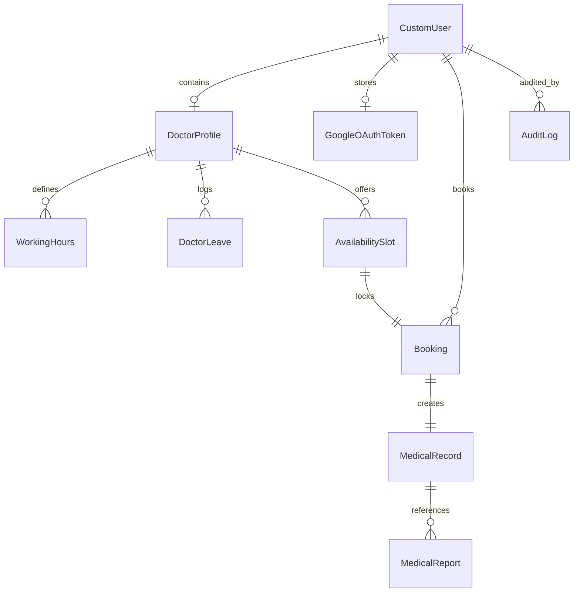
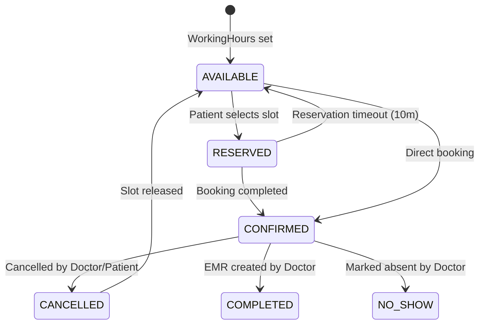
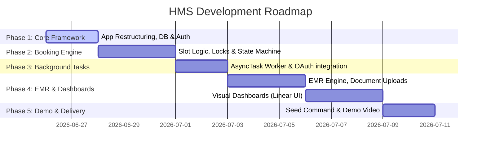

# Modern Hospital Appointment Management System - Architecture & Implementation Plan

This document details the production-grade architectural design for the Hospital Management System. It supercedes all previous plans and addresses the final engineering requirements.

---

## 1. Project Title & Philosophy
* **Project Name**: Modern Hospital Appointment Management System
* **Core Philosophy**: A production-ready scheduler for a local medical facility, demonstrating clean separation of concerns, secure transactional consistency, background logging, and a professional user interface inspired by Linear, Notion, and Stripe.

---

## 2. Django Modular Folder Structure

Instead of placing all code inside a single monolithic app, we use a modular design with clear boundaries:

```
your-repo/
├── README.md
├── requirements.txt
├── docker-compose.yml
├── .env.example
├── ai-tool-usage-log/
├── email-service/
│   ├── serverless.yml
│   ├── handler.py
│   └── ...
└── hms/
    ├── manage.py
    ├── Dockerfile
    ├── hms/                  # Project root config (settings.py, urls.py)
    ├── core/                 # Landing page, global base templates, design system stylesheets
    ├── accounts/             # CustomUser model, custom auth, and permissions
    ├── doctors/              # Profiles, working hours, scheduling rules, leaves/vacations
    ├── patients/             # Patient profiles, dashboard views
    ├── appointments/         # Availability slots, booking transactions, and state machine
    ├── medical_records/      # Electronic Medical Records (EMR) and report uploads
    ├── calendar_sync/        # Google OAuth flow and API sync triggers
    ├── notifications/        # User message center
    ├── admin_panel/          # Verification approvals, logs, audits
    └── common/               # Background task queue schema and database helpers
```

### Why this is preferable:
1. **Clean Code Navigation**: Prevents massive `models.py` or `views.py` files. It makes it easier for reviewers to audit specific modules.
2. **Strict Domain Isolation**: Models are grouped logically (e.g. all files uploads inside `medical_records`, scheduling parameters inside `doctors`).
3. **Decoupled Extensions**: Features like `calendar_sync` can be refactored or updated with zero side-effects to core scheduling logic.

---

## 3. Database Schema Design (PostgreSQL)



### Key Models

#### `accounts.CustomUser`
* `id`: UUID (PK)
* `username` / `email`: CharField (Unique)
* `role`: Enum (`DOCTOR`, `PATIENT`, `ADMIN`)
* `approval_status`: Enum (`PENDING`, `APPROVED`, `REJECTED`)
* `created_at`: DateTimeField

#### `doctors.DoctorProfile`
* `id`: UUID (PK)
* `user`: OneToOne (`CustomUser`)
* `specialization` / `hospital_name` / `bio` / `languages`
* `gov_id_file` / `medical_license_file` / `degree_certificate_file` (FileFields stored in `media/doctor_documents/`)
* `average_rating`: DecimalField

#### `doctors.WorkingHours`
* `id`: BigAutoField
* `doctor`: ForeignKey (`DoctorProfile`)
* `day_of_week`: Integer (0-6)
* `start_time` / `end_time`: TimeField
* `slot_duration_minutes` / `buffer_time_minutes`: IntegerField

#### `doctors.DoctorLeave`
* `id`: BigAutoField
* `doctor`: ForeignKey (`DoctorProfile`)
* `start_date` / `end_date`: DateField
* `reason`: TextField

#### `appointments.AvailabilitySlot`
* `id`: BigAutoField
* `doctor`: ForeignKey (`DoctorProfile`)
* `start_datetime` / `end_datetime`: DateTimeField
* `status`: Enum (`AVAILABLE`, `RESERVED`, `CONFIRMED`, `COMPLETED`, `CANCELLED`, `NO_SHOW`)

#### `appointments.Booking`
* `id`: UUID (PK)
* `reference_id`: CharField (Unique, e.g., `APT-2026-A3B9`)
* `slot`: OneToOne (`AvailabilitySlot`)
* `patient`: ForeignKey (`CustomUser`)
* `google_event_id_doctor` / `google_event_id_patient`: CharField
* `created_at`: DateTimeField

#### `medical_records.MedicalRecord` (The EMR)
* `id`: UUID (PK)
* `booking`: OneToOne (`Booking`)
* `patient`: ForeignKey (`CustomUser`)
* `doctor`: ForeignKey (`DoctorProfile`)
* `diagnosis` / `symptoms` / `consultation_notes`: TextField
* `prescription_json`: JSONField (holds medication, dosage, timings)
* `follow_up_date`: DateField
* `created_at`: DateTimeField

#### `medical_records.MedicalReport`
* `id`: UUID (PK)
* `patient`: ForeignKey (`CustomUser`)
* `medical_record`: ForeignKey (`MedicalRecord`, Null=True)
* `file`: FileField (stored in `media/medical_reports/`)
* `report_type`: Enum (`BLOOD_TEST`, `MRI`, `CT_SCAN`, `X_RAY`, `OTHER`)
* `uploaded_at`: DateTimeField

#### `calendar_sync.GoogleOAuthToken`
* `id`: BigAutoField
* `user`: OneToOne (`CustomUser`)
* `access_token` / `refresh_token`: TextField
* `token_expiry`: DateTimeField

#### `common.AsyncTask` (Local Task Queue)
* `id`: BigAutoField
* `task_type`: Enum (`SEND_EMAIL`, `CREATE_CALENDAR`, `UPDATE_CALENDAR`, `DELETE_CALENDAR`)
* `payload`: JSONField
* `status`: Enum (`PENDING`, `RUNNING`, `SUCCESS`, `FAILED`)
* `retry_count`: Integer
* `error_log`: TextField
* `created_at` / `updated_at`: DateTimeField

---

## 4. Appointment State Machine Lifecycle



### Valid Transitions:
1. `AVAILABLE` ➔ `RESERVED` / `CONFIRMED`
2. `RESERVED` ➔ `AVAILABLE` (if timer expires) or `CONFIRMED` (payment/verification success)
3. `CONFIRMED` ➔ `CANCELLED` (releases slot back to `AVAILABLE`)
4. `CONFIRMED` ➔ `COMPLETED` (triggered when the doctor submits the EMR/Prescription)
5. `CONFIRMED` ➔ `NO_SHOW` (marked by doctor after appointment window passes)

---

## 5. Booking Concurrency & Thread Isolation

We handle booking race conditions using pessimistic locking at the database level:

```python
from django.db import transaction
from appointments.models import AvailabilitySlot, Booking

def book_appointment(slot_id, patient_user):
    with transaction.atomic():
        # Lock the slot row in the DB
        slot = AvailabilitySlot.objects.select_for_update().get(id=slot_id)
        
        if slot.status != 'AVAILABLE':
            raise ValidationError("Slot is already booked or reserved.")
        
        # 1. Update slot status
        slot.status = 'CONFIRMED'
        slot.save()
        
        # 2. Write booking record
        booking = Booking.objects.create(
            slot=slot,
            patient=patient_user,
            reference_id=generate_ref_id()
        )
        
        # 3. Schedule asynchronous integration tasks in AsyncTask table
        # DO NOT call Google Calendar API or the serverless email function here.
        AsyncTask.objects.create(
            task_type='CREATE_CALENDAR',
            payload={'booking_id': str(booking.id)}
        )
        AsyncTask.objects.create(
            task_type='SEND_EMAIL',
            payload={'type': 'BOOKING_CONFIRMATION', 'booking_id': str(booking.id)}
        )
        
        return booking
```

* **Why this is superior**: Locking the database row prevents another thread from modifying the slot status. Scheduling integrations via `AsyncTask` keeps external API latencies completely outside of our local transaction block.

---

## 6. Verification & Phased Execution



### Phase 1: Modular Setup & Custom Authentication
* Restructure project into separate Django apps.
* Configure authentication views, custom authorization decorators, and files directory layout.
* Setup Docker Compose with PostgreSQL and Mailpit.

### Phase 2: Scheduling & State Transitions
* Write schedule calculator and slot builder.
* Implement transaction locks inside booking views and enforce valid state machine transitions.
* Setup verification tests simulating simultaneous booking requests.

### Phase 3: Background Worker & Integrations
* Build background command worker (`process_tasks`).
* Write Google OAuth2 credential handlers.
* Build Serverless email endpoints (`SIGNUP_WELCOME`, `BOOKING_CONFIRMATION`).

### Phase 4: EMR & Frontends
* Implement EMR models, consultation records, and prescription generators.
* Create beautiful, Stripe-like layouts for the Doctor, Patient, and Admin Dashboards.
* Build landing page showing technology stacks and interactive login options.

### Phase 5: Verification & Delivery
* Setup seed data command (`python manage.py seed_data`).
* Write project documentation (architecture diagrams, setup instructions) in README.
* Create 10-minute code walkthrough video.
